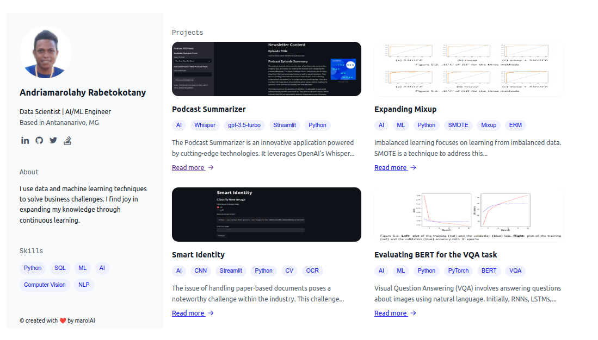

# My Portfolio Website



This is my personal portfolio website built from scratch using [Jekyll](https://jekyllrb.com/). The design is inspired by [datascienceportfol.io](https://www.datascienceportfol.io/).

## Features

- Clean and minimalistic design.
- Showcase of my projects, skills, and experience.
- Built with Jekyll for easy maintenance and customization.

## Getting Started

To view my portfolio website locally or deploy it to GitHub Pages, follow these steps:

1. Clone this repository:

```bash
https://github.com/marolAI/marolAI.github.io.git
```
Install Jekyll and its dependencies:

```bash
gem install bundler jekyll
bundle install
```
3. Serve the website locally:

```bash
bundle exec jekyll serve
```

4. Open your browser and visit `http://localhost:4000` to view the website.

## Customization

You can customize this portfolio website by modifying the Jekyll configuration, content, and design templates to suit your needs. Refer to the [Jekyll documentation](https://jekyllrb.com/docs/) for more information.

## Credits

- The design inspiration for this portfolio website is taken from [datascienceportfol.io](https://www.datascienceportfol.io/).

## License

This project is licensed under the MIT License - see the [LICENSE](LICENSE) file for details.
